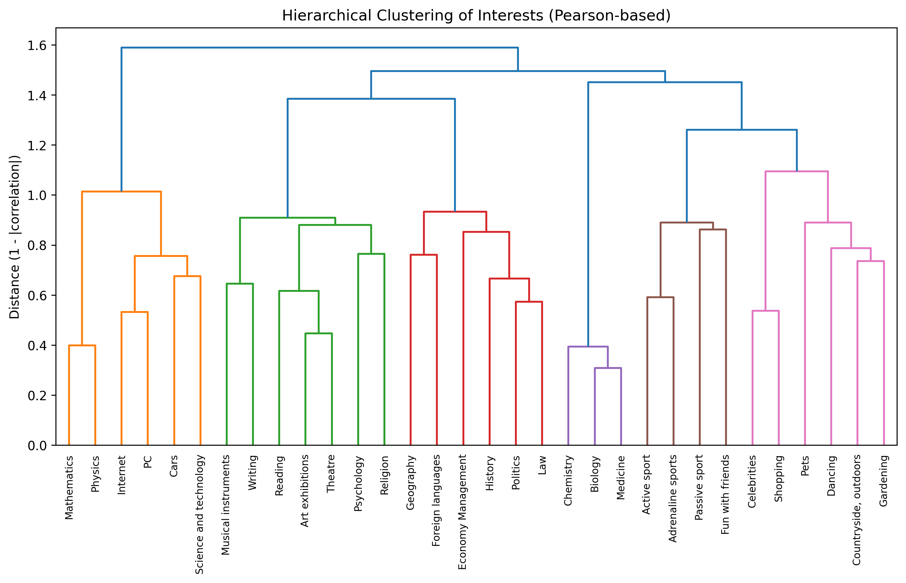
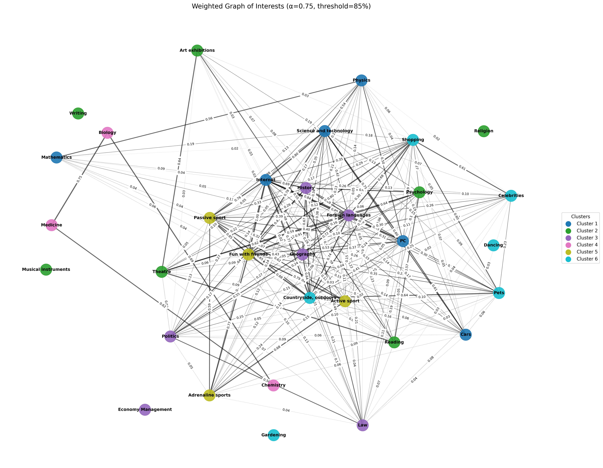

# Interest Matching Project

A personalized **hobby recommendation system** that suggests new interests to users based on their preferences.  
The project explores and compares **five different recommendation algorithms** — from simple popularity-based logic to graph and matrix factorization methods — all built from scratch to understand user behavior and generate meaningful suggestions.


## Project Structure
```bash
INTEREST MATCHING PROJECT
├── assets/                             
│   ├── cluster_graphs/                 # Graph & clustering visuals 
│   ├── eda_visuals/                    # EDA visualizations
│   └── evaluation_summary.csv          # Summary of algorithm performance
│
├── data/
│   ├── processed/                      # Cleaned datasets used for modeling
│   └── raw/                            # Original raw data
│
├── src/
│   ├── algorithms/                     # All recommendation algorithms 
│   │   ├── FOF_algo.py                 # Friends-of-Friends (graph-based)
│   │   ├── item_similarity_algo.py     # Item-based similarity model
│   │   ├── matrix_factorization.py     # Latent factor models (NMF/SVD)
│   │   ├── popularity_based.py         # Popularity with cluster awareness
│   │   └── user_similarity_algo.py     # User-based collaborative filtering
│   │
│   ├── utils/                          # Utility modules (shared functions)
│   │   ├── helpers.py
│   │   └── __init__.py
│   │
│   ├── data_preprocessing.py           # Data cleaning & preparation
│   ├── exploratory_analysis.py         # EDA functions & visualizations
│   ├── feature_engineering.py          # Feature clustering, correlation, and graph building
│   └── main.py                         # Runs full recommendation pipeline
│
├── .gitignore                          # Ignored files and folders (env, cache, etc.)
├── LICENSE                             # MIT license
├── requirements.txt
└── README.md                           # Project documentation
```


## Project Workflow

1. **Preprocessing** – Load and clean user–interest data.  
2. **Feature Engineering** – Cluster related hobbies and compute correlation matrices to capture similarity between interests.  
   Additionally, generate a *weighted graph of interests* that models the strength of relationships between hobbies, combining correlation-based similarity and cluster proximity to better capture user behavior patterns.  
3. **EDA** – Visualize patterns, distributions, correlations, and cluster relationships.  
4. **Modeling** – Run five recommender systems built from scratch:
   - Popularity-Based  
   - Friends-of-Friends (FOF)  
   - Item-Based Similarity  
   - User-Based Similarity  
   - Matrix Factorization (NMF & SVD)  
5. **Evaluation** – Measure Hit Rate, Precision, and Recall for each model and summarize overall performance.  
6. **Summary** – Generate a consolidated performance report.  

> The modular structure allows independent testing, comparison and future scalability of each algorithm.


## Algorithms — The Heart of the Project

| **Algorithm**                | **Type**                | **Description** |
|------------------------------|--------------------------|-----------------|
| **Popularity-Based (Cluster-Aware)**       | Hybrid                 | Balances global popularity with correlation and cluster-level affinity. |
| **Friends-of-Friends (FOF)** | Graph-based             | Builds and refines a weighted hobby graph, propagating scores through direct and indirect links to uncover hidden relationships. |
| **Item-Similarity**          | Content-based           | Recommends hobbies similar to those already liked by the user. |
| **User-Similarity CF**       | Collaborative Filtering | Finds users with similar profiles using Pearson and Cosine similarity. |
| **Matrix Factorization (NMF/SVD)** | Latent Factor Model | Learns hidden preference patterns through matrix decomposition. |

---
### 🔹 Algorithm 1: Popularity-Based (Cluster-Aware)

A **hybrid recommender** that extends traditional popularity models with correlation and cluster-level awareness.
Each user’s ratings are first *z-score normalized* to remove personal bias, ensuring that correlations reflect genuine preference patterns rather than rating style.
The algorithm then combines:

**Core process:**
- **Smoothed global popularity** using Bayesian averaging to handle sparse data.
- **Correlation-based personalization**, capturing how similar each hobby is to those the user already enjoys.
- **Dynamic cluster boosts**, which emphasize hobbies belonging to popular or cohesive clusters, bounded to avoid over-amplification.
- **Score blending:** combines correlation and popularity signals for balanced recommendations.  
> *Final score = 0.65 × correlation + 0.35 × popularity** 

🔸 **Visualization Example:**  *Hierarchical clustering of hobbies*  



This produces recommendations that are both personalized and globally consistent, balancing interpretability, robustness, and structural insight into user behavior.

---
### 🔹Algorithm 2: Friends-of-Friends (FOF)

A **graph-based recommender** that models hobbies as nodes in a weighted network, where edges capture their similarity and co-occurrence among users.  
Instead of relying only on direct correlations, the algorithm propagates influence through **first- and second-degree connections** — identifying indirect links between related hobbies.  

**Core process:**

- **Weighted graph construction:** Each edge weight combines item similarity and cluster correlation (from the feature-engineering stage).  
- **Graph refinement:** Reinforces strong connections based on co-occurrence support (number of users who liked both hobbies) and prunes weak ones.  
- **Indirect relationships:** Adds *friends-of-friends* edges to capture second-order relationships, enriching the network structure.  
- **Score propagation:** For each user, recommendation scores spread from liked hobbies to their direct and indirect neighbors.  
- **Normalization & filtering:** All edge weights are scaled to [0,1] and very weak links are removed to ensure robustness.  

> **Edge weight logic:**  
> \( w(i,j) = α × corr(i,j) + (1 − α) × cluster\_corr(C_i, C_j) \)

🔸 **Visualization Example:** *weighted graph of interests*



This approach uncovers both **explicit and latent relationships** between hobbies, producing recommendations that reflect structural proximity rather than just rating similarity — making it a powerful bridge between graph theory and recommender systems.

---

### 🔹 Algorithm 3: Item-Based Similarity
A **content-based** recommender that measures how similar different hobbies (items) are to one another, based on user rating patterns.
Instead of comparing users directly, it compares hobbies themselves — identifying which ones tend to be liked together.
This method is simple, interpretable, and works well when user overlap is limited.

**Core process:**
- **Item–item similarity matrix:** Compute cosine similarity between hobbies based on user ratings, using the training data only.
- **Preference extraction:** Identify all hobbies a user rated above the defined threshold.
- **Similarity aggregation:** Average similarity scores across the user’s liked hobbies to find the most related ones.
- **Filtering:** Exclude hobbies the user already rated or interacted with.
- **Recommendation generation:** Select the top-K hobbies with the highest aggregated similarity scores.

> User → liked hobbies → similarity matrix → most similar hobbies → recommendations

This algorithm is effective for discovering contextually related hobbies — for instance, users who enjoy Reading, History, or Science and Technology often receive recommendations such as Geography, Biology, or Psychology — reflecting strong behavioral co-occurrence patterns in the dataset.


---
### 🔹 Algorithm 4: User-Based Collaborative Filtering (CF)
A **memory-based collaborative filtering** algorithm that recommends hobbies to a user by finding other users with similar rating patterns.
Rather than comparing items, this method focuses on **user–user relationships**, identifying behavioral similarity through correlation and shared preferences.

It evaluates similarity using two metrics:
- Pearson correlation – normalizes personal rating bias, ideal when users rate on different scales.
- Cosine similarity – measures angular closeness between preference vectors, effective when rating patterns share similar “shapes.”

**Core process:**
- **Similarity computation:** Calculate pairwise user similarity using both Pearson correlation (mean-centered) and Cosine similarity (angle-based).
- **Neighbor selection:** Identify the top-K most similar users (“nearest neighbors”) for each target user.
- **Rating prediction:** Predict unseen ratings based on neighbor preferences.
- **Recommendation generation:** Rank all hobbies by predicted rating and recommend those the user hasn’t interacted with yet.
- **Evaluation & comparison:** Evaluate both methods on identical train/test splits

#### 🔸 Example: Pearson vs. Cosine Recommendations

| User | Pearson Recommendations | Cosine Recommendations |
|------|--------------------------|------------------------|
| 529 | History, Active sport, PC, Religion, Art exhibitions | Science & Tech, PC, Mathematics, Economy Management, Art exhibitions |
| 657 | Foreign languages, Cars, Pets, Theatre, Reading | Foreign languages, Internet, Shopping, Theatre, Reading |
| 552 | Foreign languages, Shopping, Passive sport, Internet, Biology | Dancing, Internet, Medicine, Foreign languages, Politics |

Pearson tends to recommend hobbies within the user’s behavioral cluster (consistent preferences),
while Cosine often explores broader overlaps, sometimes producing noisier but more exploratory results.

#### 🔸 Evaluation: Pearson vs. Cosine Similarity

| Metric | Pearson | Cosine |
|--------|----------|---------|
| Users evaluated | 993 | 993 |
| Hit Rate @5 (≥1 hit) | **0.985** | 0.923 |
| Hit Rate @5 (≥3 hits) | **0.574** | 0.353 |
| Precision @5 | **0.543** | 0.414 |
| Recall @5 | **0.661** | 0.486 |

**Observation:**  
Pearson correlation consistently outperforms cosine similarity across all metrics — likely because it compensates for users’ personal rating scales (e.g., users who tend to rate everything high or low), leading to a more normalized measure of behavioral similarity.

---

### 🔹 Algorithm 5: Matrix Factorization (NMF & SVD)

A **latent-factor recommender** that learns hidden relationships between users and hobbies by decomposing the user–hobby rating matrix into two smaller matrices — one representing users, the other representing hobby features.
This technique uncovers abstract dimensions of user preferences (e.g., “analytical vs. creative” interests) that drive rating behavior.

It compares two mathematical approaches:

- Non-negative Matrix Factorization (NMF): learns interpretable, additive patterns where all factors are positive (no “negative preference” concept).
- Singular Value Decomposition (SVD): captures broader variance and allows both positive and negative influences, leading to more flexible representations.

**Core process:**
- **Sparse matrix creation:** Transform the user–hobby ratings into a partially observed (sparse) matrix, simulating missing data.
- **Decomposition:** Factorize the matrix into latent user and item vectors using NMF and SVD.
- **Reconstruction:** Multiply the latent matrices to estimate missing ratings — predicting how much each user would like each hobby.
- **Recommendation generation:** Recommend the top-K hobbies with the highest predicted scores for each user.
- **Evaluation:** Compare NMF and SVD on identical train/test splits using identical metrics.
> Flow:
User–Hobby Matrix → Latent Decomposition (U × Vᵀ) → Reconstructed Ratings → Top-K Recommendations

#### 🔸 Example: NMF vs. SVD Recommendations
| User | NMF Recommendations| SVD Recommendations |
|-----------|--------------------------|--------------------------|
| 629 | Fun with friends, Reading, Psychology, History, Active sport | Fun with friends, Pets, Reading, History, Science & Tech |
| 788 | Foreign languages, Active sport, Pets, Adrenaline sports, Psychology | Foreign languages, Pets, Psychology, Geography, Biology |
| 516 | Internet, Fun with friends, Geography, Countryside, Economy Management | Fun with friends, Internet, Countryside, Geography, Psychology |

NMF emphasizes clear and interpretable latent structures, learning well-defined user preference groups.
In contrast, SVD captures deeper, subtler cross-factor interactions — often uncovering hidden affinities between hobbies that are not explicitly related.

#### 🔸 Evaluation: NMF vs. SVD

| **Metric** | **NMF** | **SVD** |
|:------------|:--------|:--------|
| Users evaluated | 993 | 993 |
| Hit Rate @5 (≥1 hit) | **0.978** | **0.978** |
| Hit Rate @5 (≥3 hits) | **0.597** | 0.580 |
| Precision @5 | **0.556** | 0.552 |
| Recall @5 | **0.675** | 0.668 |

**Observation:**  
Both NMF and SVD perform similarly on global accuracy metrics, but NMF slightly outperforms SVD in precision and recall — likely due to its non-negative constraint, which yields more stable and interpretable latent dimensions.
SVD remains more flexible for uncovering complex behavioral overlaps, making both complementary for understanding user–hobby relationships.

---
##  Models Evaluation & Comparison


To evaluate model quality, all algorithms were tested on the same dataset using **Hit Rate**, **Precision**, and **Recall** metrics at *Top-5* recommendations.  
Two variants of Hit Rate were used — one for users with at least one correct recommendation (`≥1 hit`) and one for users with multiple hits (`≥3 hits`).

| Algorithm | Hit Rate @5 (≥1 hit) | Hit Rate @5 (≥3 hits) | Precision @5 | Recall @5 | Users evaluated |
|------------|----------------------|------------------------|---------------|------------|------------------|
| **Matrix Factorization (NMF)** | **0.978** | **0.597** | **0.556** | **0.675** | 993 |
| **User-CF (Pearson)** | **0.985** | **0.574** | **0.543** | **0.661** | 993 |
| **Popularity (Cluster-Aware)** | 0.917 | 0.281 | 0.383 | 0.559 | 302 |
| **Friends-of-Friends (FOF)** | 0.914 | 0.209 | 0.354 | 0.514 | 302 |
| **Item-Based Similarity** | 0.891 | 0.195 | 0.340 | 0.492 | 302 |


> **Note on evaluation methodology:**  
> The number of evaluated users differs between algorithms because of their underlying data structures.  
> - **User-CF** and **Matrix Factorization** use *sparse rating reconstruction* — part of each user’s known ratings is hidden for testing, allowing evaluation across all users (993 total).  
> - **Popularity**, **FOF**, and **Item-Based** operate on a *train/test user split* (70% train, 30% test), resulting in ~302 users evaluated.  
>  
> This ensures that each model is tested in a realistic setup suited to its learning mechanism while maintaining consistency within each evaluation pipeline.


### Insights :

- **Matrix Factorization (NMF)** achieved the **highest recall and overall balance**, revealing its strength in uncovering hidden user–hobby relationships.  
- **User-CF (Pearson)** showed slightly higher precision, emphasizing more focused, behavior-driven recommendations.  
- **Popularity-based** performed impressively for a transparent, interpretable baseline, validating the value of cluster-aware weighting.  
- **FOF** and **Item-Based** delivered competitive results while maintaining high interpretability and structural clarity.

>  *Overall, NMF and Pearson-CF emerged as complementary top performers — one capturing latent preference structures, the other behavioral similarity patterns.*

##  How to Run the Project

This project is fully modular and can be executed end-to-end from the main script.  
It includes all preprocessing, feature engineering, and evaluation pipelines for the five implemented recommendation algorithms.

### 1. Clone the repository
```bash
git clone https://github.com/daniellaleiba/InterestMatchingProject.git
cd InterestMatchingProject
```
### 2. Install dependencies

Make sure you have Python ≥3.9 installed. Then run:
```bash
pip install -r requirements.txt
```
### 3. Run the main script

Execute the full main pipeline from the command line:
```bash
python src/main.py
```
This will:
- Load and preprocess the dataset
- Perform feature engineering and clustering
- Train and evaluate all algorithms (FOF, Popularity, Item-Based, User-CF, and Matrix Factorization)
- Print evaluation metrics and example user recommendations

### 4. Adjust parameters (optional)
You can easily modify configuration options inside main.py:
```
TOP_K = 5              # Number of recommendations per user
rating_threshold = 4   # Minimum rating considered as "liked"
n_components = 6       # Latent factors for NMF/SVD
missing_ratio = 0.4    # % of hidden ratings for evaluation
```
 ### 5. Output

When executed successfully, the console will display:
- Example user recommendations for each algorithm
- Evaluation metrics (Hit Rate, Precision, Recall)
- A final summary comparison across all models
```
◆  Friend-of-Friend (FOF) Algorithm
~~~ FOF Recommendations (Example Users) ~~~
=== Evaluation Results ===

◆  Item-Based Similarity Algorithm
~~~ Item-Based Similarity Recommendations (Example Users) ~~~
=== Evaluation Results ===
. 
. 
.

=== OVERALL ALGORITHM COMPARISON ===
```

## Project Highlights & Key Learnings

- **Developed five distinct recommendation algorithms from scratch**, combining graph-based, collaborative, and factorization-based approaches for transparent benchmarking.  
- **Integrated modular pipeline architecture** that connects preprocessing, feature engineering, model training, and evaluation into a reproducible end-to-end workflow.  
- **Explored multiple similarity paradigms** — from correlation and cluster proximity to latent user-item factors — highlighting trade-offs between interpretability and predictive strength.  
- **Built custom evaluation framework** (Hit Rate, Precision, Recall) to ensure consistent comparison across algorithms with differing data structures.  
- **Gained deeper understanding of recommender system design**, particularly how data sparsity, correlation structure, and user behavior influence recommendation accuracy.

##  Future Improvements
- Integrate hybrid weighting between CF and MF models.
- Add hyperparameter tuning and cross-validation.
- Expand dataset with demographic features for contextual personalization.

## Acknowledgments

This project was developed independently by **Daniella Leiba**  
as part of a personal data science portfolio focused on **machine learning, recommender systems, and behavioral data analysis**.

This project reflects my curiosity and love for building systems that connect people with what truly interests them.  

Special thanks to open-source Python libraries including  
**pandas, scikit-learn, matplotlib, seaborn, networkx, and Surprise** —  
which enabled flexible modeling, visualization, and evaluation of the recommendation pipeline.