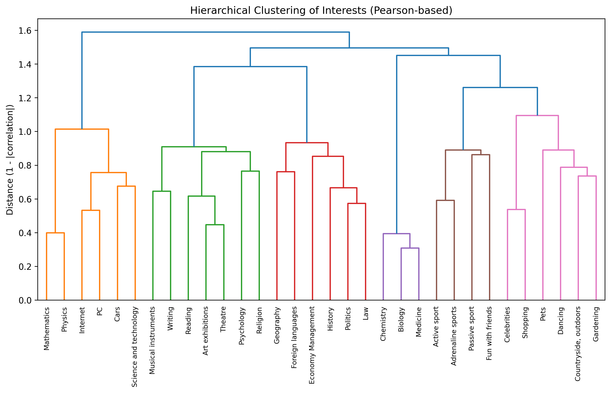
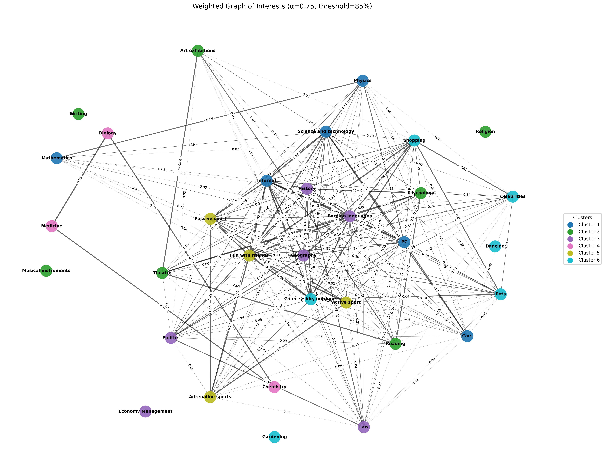

# System Documentation
This document describes the architectural design, modeling strategies, and evaluation framework of the Interest Matching recommendation system.

## 1. Architectural Design
### 1.1 High-Level Structure
```bash
INTEREST MATCHING PROJECT
├── assets/                             
│   ├── cluster_graphs/                 # Graph & clustering visuals 
│   ├── eda_visuals/                    # EDA visualizations
│   └── evaluation_summary.csv          # Summary of algorithm performance
│
├── data/
│   ├── processed/                      # Cleaned datasets used for modeling
│   └── raw/                            # Original raw data
│
├── src/
│   ├── algorithms/                     # All recommendation algorithms 
│   │   ├── FOF_algo.py                 # Friends-of-Friends (graph-based)
│   │   ├── item_similarity_algo.py     # Item-based similarity model
│   │   ├── matrix_factorization.py     # Latent factor models (NMF/SVD)
│   │   ├── popularity_based.py         # Popularity with cluster awareness
│   │   └── user_similarity_algo.py     # User-based collaborative filtering
│   │
│   ├── utils/                          # Utility modules (shared functions)
│   │   ├── helpers.py
│   │   └── __init__.py
│   │
│   ├── data_preprocessing.py           # Data cleaning & preparation
│   ├── exploratory_analysis.py         # EDA functions & visualizations
│   ├── feature_engineering.py          # Feature clustering, correlation, and graph building
│   └── main.py                         # Runs full recommendation pipeline
│
├── .gitignore                          # Ignored files and folders (env, cache, etc.)
├── LICENSE                             # MIT license
├── requirements.txt
└── README.md                           # Project documentation
```
### 1.2 Design Principles

- Modular separation of concerns
- Unified preprocessing and feature-engineering layer 
- Independent algorithm modules with consistent evaluation interface  
- Controlled experimental configuration

## 2. Data Preparation Layer
( Data Processing,  Exploratory Analysis & Feature Engineering )
### 2.1 Data Cleaning & Preparation
The preprocessing layer transforms the raw dataset into a structured modeling-ready format.  
Steps include:
- Removal of duplicate records
- Missing value handling:
    - Numeric features filled with column mean
    - Categorical features filled with mode
- Selection of 32 hobby-related columns + 2 demographic features
- Label encoding of categorical variables (`Gender`, ``Village - town``)
- Export of cleaned dataset to ``cleaned_data.csv``  

The goal of this stage is not advanced transformation, but structural consistency - ensuring all downstream algorithms operate on a clean, compact interest matrix.

## 2.2 Exploratory Analysis Layer
Before feature construction and graph modeling, an exploratory analysis layer is executed to validate structural properties of the interest matrix.  
The EDA module performs:

- Dataset integrity checks (shape, missing values, descriptive statistics)
- Distribution analysis of hobby ratings
- Correlation heatmap computation (Spearman)
- Extraction of top correlated hobby pairs
- Group comparison tests (Welch’s T-test) across demographic features
- PCA-based feature importance estimation

**This layer serves two purposes:**  
1.  **Structural validation** : ensuring the interest matrix exhibits meaningful correlation patterns before modeling.
2. **Insight extraction** : identifying dominant features and demographic variation that may influence recommendation behavior.

>  EDA outputs (plots and summaries) are stored under assets/eda_visuals/ and support downstream clustering and graph construction.

## 2.3 Feature Engineering

**1. Interest Correlation & Clustering**  
To model structural relationships between hobbies, the system computes:  

- Pearson correlation matrix between all hobby columns
- Distance metric defined as ``1 - |correlation|``
- Hierarchical clustering using Ward’s linkage

Each hobby is assigned to one of n clusters, capturing global similarity patterns.  
Additionally, average inter-cluster correlations are computed to quantify higher-level structural affinity between interest groups.

**2. Weighted Graph Construction**

A weighted interest graph is constructed to capture both local and cluster-level relationships.  
Steps:
1. Compute cosine similarity between hobby vectors
2. Compute cluster-level similarity using cluster assignments
3. Combine both signals:  
    w(i,j)=α⋅cosine(i,j)+(1−α)⋅cluster_similarity(Ci​,Cj​)
4. Normalize weights to [0,1]
5. Remove weak edges below percentile threshold
6. Keep only top-K strongest edges per node

This graph forms the structural backbone for graph-based and hybrid recommendation strategies.

## 3. Recommendation Algorithm Implementations 
### 🔹 Algorithm 1: Popularity-Based (Cluster-Aware)

A **hybrid recommender** that extends a standard popularity baseline model with correlation and cluster-level awareness.  
**Algorithm-level normalization**: user ratings are z-score normalized (per user) to reduce personal rating-scale bias, so similarity signals reflect preference structure rather than rating style.

**Core process:**
- **Smoothed global popularity** Bayesian averaging is used to stabilize popularity estimates under sparse ratings.
- **Correlation-based contextual relevance**: candidate hobbies are scored by similarity to the user’s known high-interest hobbies.
- **Cluster-aware boosting**: candidates receive a bounded boost based on cluster cohesion / cluster-level affinity, preventing over-amplification.
- **Score blending:** combines contextual relevance and popularity for balanced recommendations.
> *Final score = 0.65 × ContextualRelevance + 0.35 × popularity** 

**Visualization Example:**  *Hierarchical clustering of hobbies*  


**Why this approach**: produces recommendations that remain interpretable and robust, while capturing both global trends and local interest structure.

---
### 🔹 Algorithm 2: Friends-of-Friends (FOF)

A **graph-based recommender** strategy that models hobbies as nodes in a weighted network.  
Edges encode structural similarity derived from correlation and cluster-level affinity.  
Unlike direct similarity models, this approach propagates influence across both **first- and second-degree connections**, capturing indirect relationships between related hobbies.

**Core process:**

- **Weighted graph foundation:**
Edge weights combine item-level correlation and cluster-level similarity (derived from the feature engineering stage). 
- **Graph refinement:** Edge strength is reinforced using co-occurrence support (number of users engaging with both hobbies), while weak connections are pruned.
- **Second-order expansion (FOF):** Additional edges are introduced between second-degree neighbors to model indirect structural proximity. This enriches the network structure.  
- **Score propagation:** For a given user, recommendation scores propagate from liked hobbies across direct and indirect neighbors in the graph. 
- **Normalization & filtering:** Edge weights are scaled to [0,1], and very weak links are removed to preserve robustness.  

> **Edge weight Formula:**   
w(i,j) = α⋅corr(i,j) + (1-α)⋅cluster_corr(Ci​,Cj​)

**Visualization Example:** *weighted graph of interests*



**Design Rationale:**  
This approach captures both direct similarity and higher-order structural relationships.
It bridges collaborative filtering concepts with graph propagation dynamics, enabling recommendations driven by network topology rather than only pairwise similarity.

---

### 🔹 Algorithm 3: Item-Based Similarity
An **item-based** recommendation strategy that computes similarity between hobbies (items) using user-item interaction patterns.
Instead of comparing users, the model builds an **item-item** view and recommends hobbies that are most similar to what the user already likes.

This approach is lightweight, interpretable, and performs well when user overlap is limited.

**Core process:**
- **Item-item similarity matrix:** Compute cosine similarity between hobby vectors (on training data only).
- **Preference extraction:** Identify the set of hobbies the user rated above a predefined threshold.
- **Similarity aggregation:** Aggregate similarity scores from the user’s liked hobbies to candidate hobbies (e.g., mean similarity across liked items).
- **Filtering:** Exclude hobbies the user already rated / interacted with.
- **Recommendation generation:** Return Top-K hobbies with the highest aggregated similarity score.

Pipeline summary:
> User → liked hobbies → similarity matrix  → aggregated similarity → Top-K recommendations

**Design rationale:**  
Item-based similarity captures contextual relatedness between hobbies directly from co-preference patterns.
It provides a strong interpretability baseline and a stable fallback when user-based similarity becomes unreliable under sparse user-user overlap.


---
### 🔹 Algorithm 4: User-Based Collaborative Filtering (CF)
A **memory-based collaborative filtering** strategy that generates recommendations by identifying users with similar rating behavior.

Instead of modeling item relationships, this approach operates in *user space*: leveraging **user–user similarity** to infer unseen preferences.

Two similarity metrics are evaluated:
- Pearson correlation: mean-centered similarity, compensates for individual rating scale bias.
- Cosine similarity: angle-based similarity, capturing geometric proximity between preference vectors

**Core process:**
- **Similarity computation:** Compute pairwise user similarity using both Pearson (mean-centered) and Cosine metrics.
- **Neighbor selection:** Select Top-K most similar users (nearest neighbors) for each target user.
- **Rating prediction:** Estimate unseen ratings using weighted aggregation of neighbor ratings.
- **Recommendation generation:** Rank candidate hobbies by predicted rating and return Top-K unseen items.
- **Controlled evaluation:** Both similarity metrics are evaluated on identical train/test splits for fair comparison.
#### 🔸 Example: Pearson vs. Cosine Recommendations

| User | Pearson Recommendations | Cosine Recommendations |
|------|--------------------------|------------------------|
| 529 | History, Active sport, PC, Religion, Art exhibitions | Science & Tech, PC, Mathematics, Economy Management, Art exhibitions |
| 657 | Foreign languages, Cars, Pets, Theatre, Reading | Foreign languages, Internet, Shopping, Theatre, Reading |
| 552 | Foreign languages, Shopping, Passive sport, Internet, Biology | Dancing, Internet, Medicine, Foreign languages, Politics |

Pearson-based recommendations tend to remain within the user’s established behavioral cluster,
while Cosine similarity often explores broader overlaps, occasionally introducing higher variance in output.

#### 🔸 Evaluation: Pearson vs. Cosine Similarity

| Metric | Pearson | Cosine |
|--------|----------|---------|
| Users evaluated | 993 | 993 |
| Hit Rate @5 (≥1 hit) | **0.985** | 0.923 |
| Hit Rate @5 (≥3 hits) | **0.574** | 0.353 |
| Precision @5 | **0.543** | 0.414 |
| Recall @5 | **0.661** | 0.486 |

**Design observation:**  
Pearson correlation consistently outperforms Cosine similarity across all evaluated metrics.
This suggests that mean-centering mitigates individual rating-scale bias, producing a more stable behavioral similarity signal.

---

### 🔹 Algorithm 5: Matrix Factorization (NMF & SVD)

A **latent-factor recommender**  strategy that models hidden user-hobby relationships by decomposing the user-item rating matrix into lower-dimensional representations.

This approach captures abstract preference dimensions that are not directly observable from explicit correlations.

Two decomposition techniques are evaluated:

- **Non-negative Matrix Factorization (NMF)**: Learns additive, non-negative latent factors, resulting in interpretable preference structures.
- **Singular Value Decomposition (SVD)**: Allows both positive and negative latent components, capturing broader variance and cross-factor interactions.

**Core process:**
- **Sparse matrix construction:** Construct a partially observed user-hobby matrix from training data, simulating real-world missing ratings.
- **Latent decomposition:** Factorize the matrix into low-rank user and hobby matrices (using NMF and SVD):     *R ≈ V ᵀ ⋅ U*
- **Matrix reconstruction:** Reconstruct missing entries by multiplying latent representations.
- **Recommendation generation:** Rank hobbies by predicted rating and return Top-K unseen items.
- **Controlled  Evaluation:** Compare NMF and SVD under identical train/test splits and evaluation metrics.
> Pipeline summary:  
User-Hobby Matrix → Latent Decomposition (U × Vᵀ) → Reconstructed Ratings → Top-K Recommendations

#### 🔸 Example: NMF vs. SVD Recommendations
| User | NMF Recommendations| SVD Recommendations |
|-----------|--------------------------|--------------------------|
| 629 | Fun with friends, Reading, Psychology, History, Active sport | Fun with friends, Pets, Reading, History, Science & Tech |
| 788 | Foreign languages, Active sport, Pets, Adrenaline sports, Psychology | Foreign languages, Pets, Psychology, Geography, Biology |
| 516 | Internet, Fun with friends, Geography, Countryside, Economy Management | Fun with friends, Internet, Countryside, Geography, Psychology |

NMF tends to produce more stable and interpretable latent groupings,  
while SVD captures deeper, subtler cross-factor interactions, often uncovering hidden affinities between hobbies that are not explicitly related.

#### 🔸 Evaluation: NMF vs. SVD

| **Metric** | **NMF** | **SVD** |
|:------------|:--------|:--------|
| Users evaluated | 993 | 993 |
| Hit Rate @5 (≥1 hit) | **0.978** | **0.978** |
| Hit Rate @5 (≥3 hits) | **0.597** | 0.580 |
| Precision @5 | **0.556** | 0.552 |
| Recall @5 | **0.675** | 0.668 |

**Design observation:**
Both approaches achieve comparable global accuracy.  
NMF shows slightly stronger precision and recall, likely due to its non-negativity constraint producing more stable latent structures.  
SVD remains more flexible for uncovering complex behavioral overlaps,  capturing subtle cross-factor interactions.


## 5. Evaluation Framework
### 5.1 Evaluation Setup
All models were evaluated under a consistent Top-K recommendation framework.  
Configuration:
- Top-K = 5 recommendations per user
- Positive interaction defined as rating ≥ 4
- Metrics:
    - Hit Rate @5 (≥1 hit)
    - Hit Rate @5 (≥3 hits)
    - Precision @5
    - Recall @5  

Two Hit Rate variants were used:  
- ≥1 hit: At least one correct recommendation in Top-5
- ≥3 hits: At least three correct recommendations in Top-5  
The dual definition captures both minimal relevance and stronger behavioral alignment.

### 5.2 Model-Specific Evaluation Strategy
Different algorithm families require different evaluation setups due to structural differences:  
- **User-Based CF and Matrix Factorization**  
Use sparse rating reconstruction.  
A portion of each user’s known ratings is hidden (missing_ratio = 0.4) and predicted by the model.
This enables evaluation across all users (993 total).
- **Popularity-Based, FOF, and Item-Based models**  
Use a train/test user split (70% train, 30% test).
Recommendations are generated for test users only (~302 users evaluated).  

Each model is evaluated under a setup aligned with its learning mechanism while preserving metric consistency within its family.

## 6. Comparative Results  
All models were evaluated under the same Top-5 recommendation setting.

| Algorithm | Hit Rate @5 (≥1 hit) | Hit Rate @5 (≥3 hits) | Precision @5 | Recall @5 | Users evaluated |
|------------|----------------------|------------------------|---------------|------------|------------------|
| **Matrix Factorization (NMF)** | **0.978** | **0.597** | **0.556** | **0.675** | 993 |
| **User-CF (Pearson)** | **0.985** | **0.574** | **0.543** | **0.661** | 993 |
| **Popularity (Cluster-Aware)** | 0.917 | 0.281 | 0.383 | 0.559 | 302 |
| **Friends-of-Friends (FOF)** | 0.914 | 0.209 | 0.354 | 0.514 | 302 |
| **Item-Based Similarity** | 0.891 | 0.195 | 0.340 | 0.492 | 302 |

## 7. System-Level Insights

### 7.1 Model Trade-offs
The comparative evaluation highlights distinct strengths across algorithm families:
- **Matrix Factorization (NMF)**  
Achieves the highest recall and strongest overall balance, indicating effectiveness in capturing latent user-hobby structures.
- **User-Based CF (Pearson)**  
Shows slightly higher precision, reflecting tighter behavioral similarity alignment.
- **Popularity-Based (Cluster-Aware)**  
Provides a transparent and stable baseline, validating the value of cluster-aware weighting.
- **Friends-of-Friends (FOF)**  
Captures indirect structural relationships through graph propagation.
- **Item-Based Similarity**  
Serves as a lightweight, interpretable fallback model under sparse overlap conditions.

### 7.2 Complementarity of Approaches
Latent-factor and user-similarity models emerge as complementary strategies:
- Matrix Factorization captures abstract preference dimensions.
- Pearson-CF captures explicit behavioral similarity patterns.   

Together, they represent complementary modeling paradigms: latent representation learning and explicit behavioral similarity.

## 8. Configurability
The system exposes key experimental parameters within ``main.py``:
```
TOP_K = 5         
rating_threshold = 4   
n_components = 6      
missing_ratio = 0.4    
```
Parameter roles:
- `TOP_K` : controls recommendation list length
- `rating_threshold` : Minimum rating considered as "liked" (boundary for positive feedback)
- `n_components` : determines latent dimensionality in NMF/SVD
- `missing_ratio` : controls sparsity simulation in reconstruction-based evaluation

This configuration layer enables controlled experimentation across modeling paradigms while maintaining pipeline consistency.

---
This modular and experiment-driven architecture supports extensibility, reproducibility, and systematic comparison across recommendation strategies.